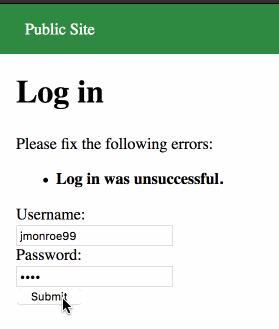
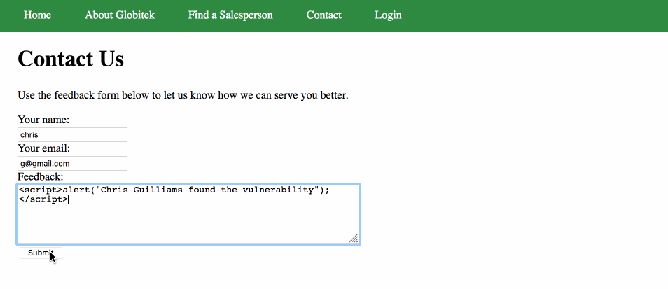
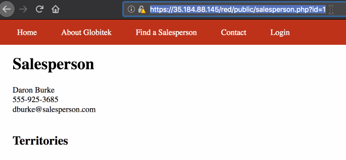
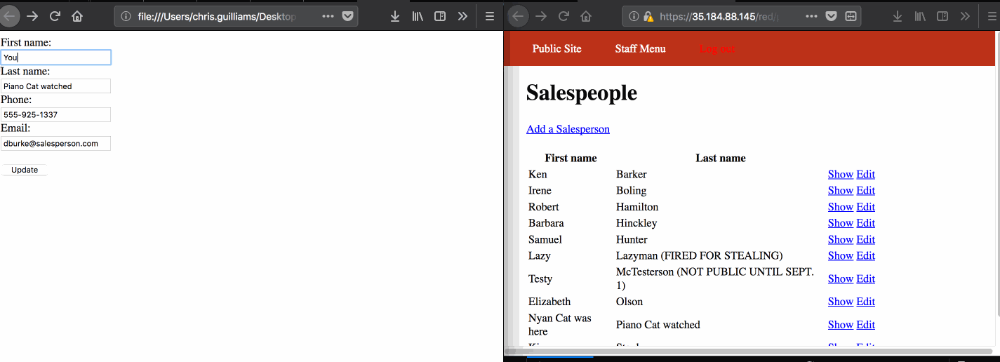

# CodePathWeek8
# Project 8 - Pentesting Live Targets

Time spent: **X** hours spent in total

> Objective: Identify vulnerabilities in three different versions of the Globitek website: blue, green, and red.

The six possible exploits are:
* Username Enumeration
* Insecure Direct Object Reference (IDOR)
* SQL Injection (SQLi)
* Cross-Site Scripting (XSS)
* Cross-Site Request Forgery (CSRF)
* Session Hijacking/Fixation

Each version of the site has been given two of the six vulnerabilities. (In other words, all six of the exploits should be assignable to one of the sites.)

## Blue

Vulnerability #1: Session Hijacking/Fixation

Vulnerability #2: __________________

## Green

Vulnerability #1: Username Enumeration  
When a valid username is entered the error that is displayed is in bold. When a username that is not valid is entered the error that is displayed is not in bold.

Vulnerability #2: XSS 
Feedback form doesn't sanitize HTML elements

## Red

Vulnerability #1: IDOR
You are able to see hidden salespeople (Ones who might have been let go for one reason or another...)
The other two sites prevented this from occuring by redirecting the user to another page when they were not logged in as an admin and attempted to view the hidden users.

Vulnerability #2: CSRF
Using the CSRF token taken from the form element you can update the values on the site without being logged in

## Notes

Describe any challenges encountered while doing the work

